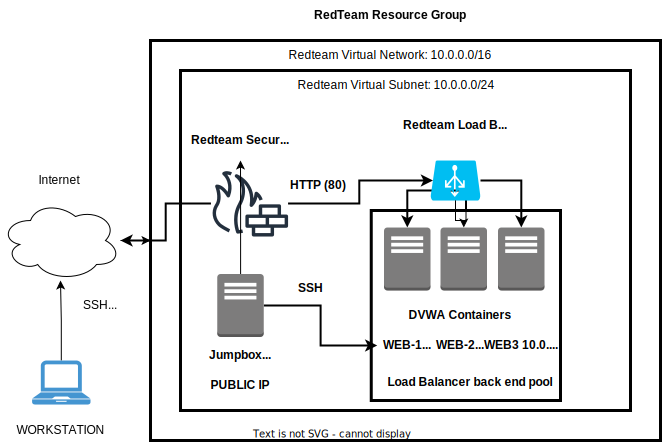

# Cloud Network

Collection of Linux Scripts and Ansible Scripts create to help ease ELK server startup.

Most of the scripts are used to configure cloud servers with different docker containers.

The final output would be 4 Ubuntu servers running DVWA containers accesible by a Jumpbox and a server running an ELK stack container. 

